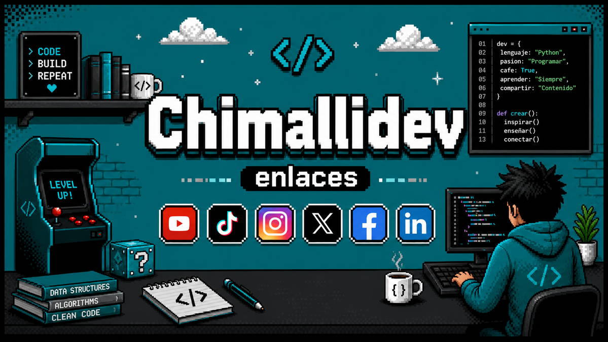
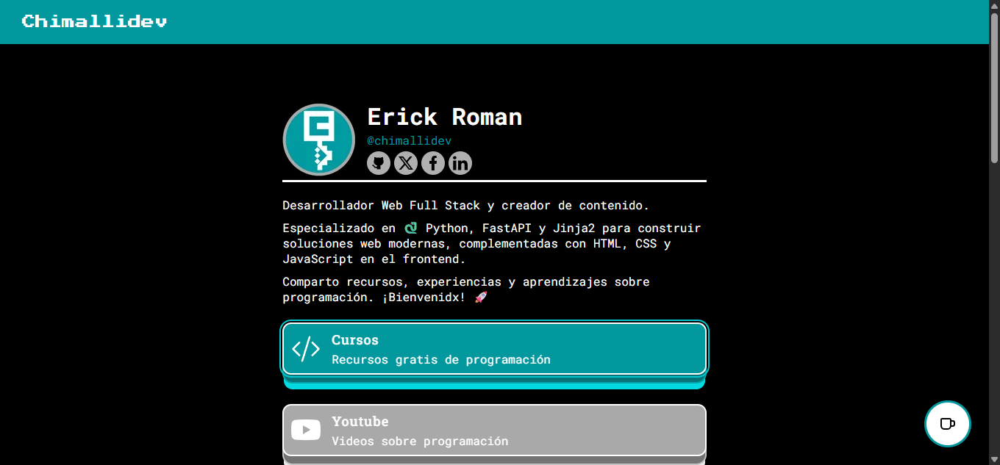

# &nbsp;Página de enlaces de Chimallidev v4

## Descripción

Página web de enlaces para centralizar mis proyectos, redes sociales y contenido sobre programación. Esta versión 4 está actualizada con mi stack actual centrado en Python, FastAPI y Jinja2, e incluye mejoras en diseño, estructura y experiencia de usuario para una navegación más clara.

## Autor 💻
**Erick Roman**

* [LinkedIn](https://www.linkedin.com/in/chimallidev)
* [Portafolio](https://portafolio-chimallidev.onrender.com/)

## Vista Previa

## DEMO, Ver ejemplo en vivo

[DEMO](https://chimallidev-links.onrender.com/)

## Tecnologías utilizadas

<h4> Lenguaje </h4>
 
  
  
 

<h4> Frontend </h4>
 
  
  
  
  

<h4> Backend </h4>
 
  
  
  

<h4> Herramientas </h4>
 
  
  
  

## Documentación 📑

## Contratación

Si quieres contratarme puedes escribirme a chimalli.dev@gmail.com para consultas.

## 🚀 Impulsa nuevos proyectos y contenido

🌌 Si te gusta esta proyecto, puedes darle una ⭐ y compartirlo con amigos.

